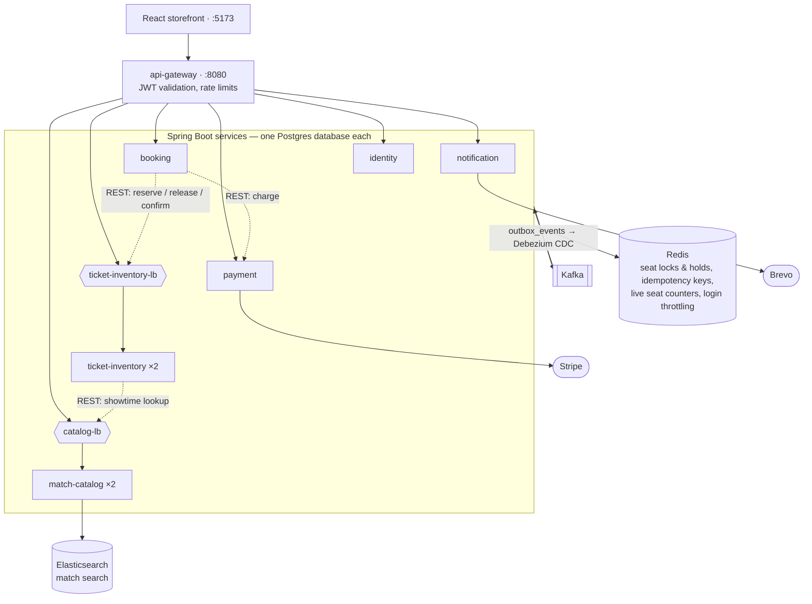

# Stadium Ticketing Platform

An event-driven stadium ticket booking platform: browse matches, hold seats, pay, and get
confirmed — built as seven Spring Boot services, one of them a reactive gateway, with a React
storefront.

The interesting part of this codebase is not the CRUD; it is what happens when a step fails
halfway. Seats are held under a distributed lock, payment runs as a saga with compensations, and
every cross-service event goes out through a transactional outbox read by Debezium — so a broker
hiccup between "money taken" and "booking confirmed" cannot lose the event.



Solid arrows are what a request touches; dotted ones are the service-to-service calls inside the
booking saga. Everything else between services is an event — see *Who produces and consumes what*
under *Architecture notes*.

---

## Stack

| Layer | Choice |
|---|---|
| Language / runtime | Java 25, Spring Boot 4.1, Spring Cloud Gateway 5 |
| Persistence | PostgreSQL 16 (one database per service), Flyway migrations |
| Cache / locks | Redis 7 via Redisson |
| Messaging | Kafka + Kafka Connect with Debezium CDC (outbox pattern) |
| Search | Elasticsearch 9.5 (match catalog read model) |
| Frontend | React 19, Vite, TypeScript, Tailwind, React Router, React Hook Form + Zod |
| Observability | Metrics: Actuator + Micrometer → Prometheus → Grafana. Logs: Spring Boot ECS JSON → Logstash → Elasticsearch → Kibana |
| Testing | JUnit 5, Mockito, Testcontainers, Embedded Kafka |

---

## Services

| Service | Port | Responsibility |
|---|---|---|
| `api-gateway` | 8080 | Single entry point. Validates JWTs, strips spoofed identity headers, enforces per-route rate limits. Purely technical — no domain model. |
| `identity-service` | 8081 | Registration, email verification, login, refresh-token rotation with reuse detection, password reset. |
| `match-catalog-service` | 8082 | Matches and showtimes. CQRS: Postgres for writes, Elasticsearch for browse/search. **Runs as 2 instances.** |
| `ticket-inventory-service` | 8083 | Seat availability and holds, guarded by a Redisson lock so two customers cannot take the same seat. **Runs as 2 instances.** |
| `payment-service` | 8084 | Payment initiation, Stripe webhooks, refunds, and reconciliation of payments that were charged but never confirmed. |
| `notification-service` | 8085 | Consumes domain events and sends transactional email through Brevo; keeps an in-app notification feed. |
| `booking-service` | 8086 | Orchestrates the booking saga across inventory and payment, with compensations and reconciliation jobs. |
| `frontend` | 5173 | React storefront. |

Those are the services' own ports, and for six of the seven the host publishes the same number.
`ticket-inventory-service` is the exception: reach it on the host at **8087**, not 8083 — its load
balancer had to move aside because host 8083 is Kafka Connect (see the table under *Running it*).

`common` is a shared library, not a service: JWT filter, correlation-id filter, the RFC 7807
exception handler, `KafkaTopics`, the ShedLock configuration, and the transactional outbox — its
entity, repository, purge job and the publisher base class every service extends with nothing but
its own event-to-topic mapping.

### The replicated services

`ticket-inventory-service` and `match-catalog-service` each run as two instances behind an nginx
load balancer (`infra/nginx/ticket-inventory-lb.conf`, `infra/nginx/catalog-lb.conf`); the other
five run as one. The point is not throughput on a laptop, and the two are replicated for different
reasons.

**ticket-inventory-service** — its correctness rests on machinery a lone process cannot exercise:

| Mechanism | Why one instance proves nothing |
|---|---|
| Redisson seat lock | A JVM-local lock and a Redis-backed one behave identically until a second process competes for the same seat. |
| ShedLock on the reconcilers and outbox cleanup | The `shedlock` row only ever has one claimant, so the guard never has to reject anyone. |
| Kafka consumer-group rebalancing | A group of one is never rebalanced. |

`scripts/load-test/seat-lock-contention.ps1` is the test that needs both instances up — see
*Load and contention tests* under *Tests and CI*.

**match-catalog-service** — nothing here is unsafe across instances; what a second one exposes is
the price of its local cache tier. `CachingMatchRepository.save()` invalidates Redis and the
writing pod's own Guava cache, but cannot reach into the other pod's, so an admin publish or cancel
stays visible-as-stale on the other instance until its 5s TTL expires. That window exists on any
multi-pod deployment and is invisible on one. `availableSeats` is unaffected: `overlayLiveSeats`
re-reads it from the live seat counter on every return and never takes it from either Match cache
tier. (That read still passes through `AdaptiveTtlLiveSeatStore`, whose own 1s local TTL is
dropped the moment this pod writes the counter and is bypassed entirely once a count falls below
the scarcity threshold.)

`booking-service` deliberately stays single. It has the same ShedLock and consumer-group machinery,
but its contested path — the Redis idempotency claim on `POST /bookings` — sits behind the
`bookings.idempotency_key` unique index, which rejects a duplicate however many instances are
running. A second booking instance would verify a guarantee that already holds.

Callers address a load balancer (`ticket-inventory-lb:8083`, `catalog-lb:8082`), never an instance.
Each instance is *also* published directly on the host, for when you need to ask one specific
instance a question while debugging. Those host ports are
`<instance number><the service's own port>` — 18083/28083 for inventory, 18082/28082 for the
catalog — so a third instance would be 38083 without anyone having to invent a number.

Because there is no service registry, nginx only knows the instances written into its `upstream`
block, and its health checking is passive (an instance drops out *after* failing three requests).
Adding a third instance means one more `server` line, one more compose stanza, and one more
Prometheus target. That manual step is the trade being made: Eureka or Consul would remove it, at
the cost of another always-on container to keep healthy.

Two details in the nginx configs are load-bearing rather than boilerplate. `proxy_next_upstream`
deliberately omits `non_idempotent` in both, so a POST already handed to an instance is never
replayed against the other one — retrying a seat reservation that may have succeeded is how a seat
gets sold twice, and the catalog's admin writes share a path prefix with its reads.

The balancing strategies differ on purpose. Inventory uses `least_conn`, because a reserve call can
sit on the seat lock for seconds while an availability read returns immediately, so in-flight count
is a far better load signal than request share. The catalog uses plain round-robin: nothing there
blocks, and an even split is what makes the local-cache divergence window observable in the first
place.

---

## Architecture notes

**Hexagonal, per service.** `domain` holds the model and invariants and depends on nothing.
`application` holds use cases and declares ports. `adapter/in` and `adapter/out` are the only
places that know about HTTP, Kafka, JPA or Redis. Domain events are raised on the aggregate and
pulled by the application service.

**Transactional outbox + CDC, not direct publishing.** No service calls `KafkaTemplate.send()` in
a business flow. Events are written to an `outbox_events` row in the *same transaction* as the
aggregate change; Debezium tails that table via Postgres logical replication and produces to Kafka.
A crash between the database commit and the broker therefore cannot drop an event. Connector
configs live in `backend/*/infra/debezium/`.

**Saga with compensation.** `booking-service` drives hold → pay → confirm. Each step has a
compensating action, and two reconciliation jobs sweep for bookings left stuck when an event never
arrived.

**The live seat count moves atomically, in Redis first.** `showtimes.available_seats` in Postgres
is the durable record, but what a browse page shows comes from a Redis counter, seeded when the
showtime is created and decremented on every projected sale. That decrement is a single Lua
`EVAL` — read, floor at zero, write — because the obvious alternative (update Postgres, read the
new total back, overwrite the key) is a read-modify-write across two systems: two overlapping
sales both read before either writes, and the slower one restores seats that were already sold.
Postgres follows the script; a failed write hands back exactly what the script deducted, and any
branch where the two disagree rebuilds the counter from the committed row.

**Idempotency everywhere a retry can reach.** Redis-backed idempotency keys on booking and payment
initiation; a `processed_events` table in notification-service; consumers assume redelivery.

**Who produces and consumes what.** Topic names live in `common`'s `KafkaTopics`; each service's
`OutboxEventPublisher` maps its own domain events onto them, and every consumer below is a
`@KafkaListener` in that service's `adapter/in/messaging`.

| Topic | Produced by | Consumed by |
|---|---|---|
| `identity.account.registered` | identity | notification — verification email |
| `identity.account.activated` | identity | notification — activation-confirmed email |
| `identity.account.password-reset-requested` | identity | notification — reset-link email |
| `catalog.match.published` | match-catalog | match-catalog — re-reads the match and writes the Elasticsearch document |
| `catalog.match.cancelled` | match-catalog | match-catalog — search index; ticket-inventory — marks the showtimes unbookable; booking — cancels every active booking and requests refunds for the paid ones |
| `catalog.match.completed` | match-catalog | match-catalog — search index; ticket-inventory — marks the showtimes unbookable |
| `catalog.showtime.created` | match-catalog | ticket-inventory — generates the seat map for the stadium |
| `inventory.seats.reserved` | ticket-inventory | *(nobody yet — audit trail)* |
| `inventory.seats.released` | ticket-inventory | *(nobody yet — audit trail)* |
| `inventory.seats.sold` | ticket-inventory | match-catalog — decrements the live seat counter |
| `booking.booking.created` | booking | notification |
| `booking.booking.confirmed` | booking | notification — ticket confirmation email |
| `booking.booking.cancelled` | booking | notification |
| `booking.refund.requested` | booking | payment — refunds the Stripe charge |
| `payment.payment.initiated` | payment | *(nobody yet — audit trail)* |
| `payment.payment.succeeded` | payment | booking — drives the saga to CONFIRMED; notification — receipt email |
| `payment.payment.failed` | payment | booking — compensates: cancels the booking, releases the seats |
| `payment.payment.refunded` | payment | notification — refund email |

Two things the table makes visible. The catalog consumes its own lifecycle events: the
Elasticsearch document is written by a consumer that re-reads Postgres, never by the request that
published the match, so a stale event payload cannot put a stale document in the index. And
`catalog.match.cancelled` fans out to three services, which is why a cancellation costs one
transaction in the catalog and nothing else — each downstream reaction is that service's own
problem, retried and dead-lettered independently.

**Events that exhaust retries go to `<topic>-dlt`** and a dead-letter consumer logs one line
naming the topic, the offset and the exception that caused it — at ERROR behind an `ALERT:`
prefix, except ticket-inventory-service's bookability-cache consumer, which logs at WARN because
a stale cache costs a round trip rather than a booking. A `-dlt` topic belongs to a topic, not to
a service, so where two services consume the same topic each consumer reports only the failures
of its own consumer group and skips the other's. Nothing replays them automatically — a poison
pill would replay identically forever.

---

## API

There is no OpenAPI document — the contract is the controllers under each service's
`adapter/in/web`, and the gateway's `application.yaml` decides which paths need a token. Every
path below is relative to the gateway (`http://localhost:8080`), which routes on the first
segment after `/api/v1/`. Responses are JSON; errors are RFC 7807 problem details.

| Endpoint | Who | What |
|---|---|---|
| `POST /api/v1/auth/register` · `/login` · `/refresh` · `/logout` | public | Refresh tokens rotate on every use; presenting an already-rotated one is reuse and revokes the session. |
| `GET /api/v1/auth/verify-email?token=…` · `POST …/resend-verification` | public | The link the verification email carries lands here, on the gateway. |
| `POST /api/v1/auth/forgot-password` · `/reset-password` | public | |
| `GET /api/v1/matches` · `/matches/{id}` · `/matches/stadiums` | public | Browse and search (`q`, paging) — served from Elasticsearch, with `availableSeats` overlaid from the live Redis counter. |
| `POST /api/v1/matches` · `POST /matches/{id}/showtimes` · `PUT /matches/{id}/publish` · `/cancel` · `/complete` | ADMIN | The match lifecycle. A showtime names one of the three built-in stadiums (`StadiumCatalog`); its seat map is generated by ticket-inventory-service off the resulting event. |
| `GET /api/v1/inventory/{showtimeId}/layout` · `/seats` | customer | Seat map with live holds; each HELD seat says whether the hold is the caller's own. |
| `POST` / `DELETE /api/v1/inventory/{showtimeId}/hold` | customer | A pre-booking hold placed the moment a seat is clicked, TTL 10 minutes, owned by the customer. |
| `POST /api/v1/inventory/{showtimeId}/reserve` · `DELETE …/reserve/{bookingId}` · `POST …/confirm` | booking-service | Saga steps. `reserve` turns the customer's hold into the booking's and returns the server-computed price; `confirm` accepts only an internal-service token, since no genuine post-payment confirmation ever carries a customer's JWT. |
| `POST /api/v1/bookings` | customer | Runs the saga on the request thread: draft → reserve → PENDING_PAYMENT → charge → `booking.booking.created`. Send an `Idempotency-Key` header; a retry with the same key gets the same booking. |
| `GET /api/v1/bookings` · `/bookings/{id}` · `PUT /bookings/{id}/cancel` | customer | Own bookings only. Cancel is accepted only from PENDING_PAYMENT — a CONFIRMED booking involves money the customer cannot yet refund alone. |
| `POST /api/v1/payments` · `POST /payments/{paymentId}/retry` · `GET /payments/{bookingId}` | customer | The charge is always the amount booking-service computed from the seat tiers; the request's own `amount` is checked against it, never trusted. |
| `POST /api/v1/payments/webhook` | Stripe | Signature-verified. The async backstop for the synchronous charge — e.g. the process dying between Stripe answering and the outcome being persisted. |
| `GET /api/v1/notifications` · `PATCH /notifications/{id}/read` | customer | The in-app feed notification-service keeps alongside the emails it sends. |

"customer" means any valid access token; the gateway forwards identity as headers it sets itself,
after stripping any the client sent. `GET /api/v1/showtimes/{id}` also exists on the catalog but
is not routed by the gateway — it is the lookup ticket-inventory-service makes when it needs to
know whether a showtime is still bookable.

---

## Running it

Everything runs in Docker Compose.

```bash
cp .env.example .env      # then fill in the [REQUIRED] values
cp infra/postgres-exporter/config.yaml.example infra/postgres-exporter/config.yaml
docker compose up -d
```

Two files to copy, not one. postgres_exporter's `auth_modules` block has no environment-variable
substitution, so its database credentials can neither come from `.env` nor be committed — the
template exists to be filled in with the same `DB_USERNAME`/`DB_PASSWORD` you just put there.
`docker-compose.yaml` bind-mounts that exact path, so skipping the copy leaves Docker inventing a
directory where the file should be and the exporter never starts.

`docker-compose.yaml` is a **development stack, not a deployable topology**. Kafka runs PLAINTEXT
with no authentication, and Postgres, Redis and Elasticsearch are protected by nothing but the
passwords in `.env`. Every infrastructure port therefore publishes to `127.0.0.1` only — reachable
from the machine running Compose and nowhere else. Kafka is the reason that matters: consumers on
those topics sit past every check the gateway makes, so a forged `payment.succeeded` would confirm
a booking nobody paid for.

The individual service ports bind to loopback as well. Every service validates its own JWTs, so
this is not about authentication — it is that reaching a service directly skips the gateway's rate
limits and public-path policy. **Two ports publish on all interfaces: `8080` (the gateway) and
`5173` (the storefront).** Everything else in the table below is reachable from the machine running
Compose, which is where you are.

`.env.example` documents every variable, which are required, and where to get the third-party
ones. At minimum you need database and Redis passwords, a JWT secret, a Stripe **test** key, and
Brevo API credentials for outgoing email.

Once the stack is healthy:

| | |
|---|---|
| Storefront | http://localhost:5173 |
| API (through the gateway) | http://localhost:8080 |
| Prometheus | http://localhost:9090 |
| Grafana | http://localhost:3000 |
| Kibana | http://localhost:5601 |
| Kafka Connect | http://localhost:8083/connectors |

Services declare healthchecks against `/actuator/health`, and dependants wait on
`condition: service_healthy` — so `docker compose up` finishing means the platform is actually
ready to serve, not merely that containers launched.

### Your first booking

The stack comes up empty: there is no seed data, and only an ADMIN can create a match. So before
`docker compose up`, set two more values in `.env`:

```
ADMIN_BOOTSTRAP_EMAIL=admin@example.com
ADMIN_BOOTSTRAP_PASSWORD=<something long>
```

`AdminBootstrapRunner` in identity-service creates that account on startup — already ACTIVE, with
the ADMIN role — and does nothing on later starts once any ADMIN exists. If the address is already
registered as a customer, that account is promoted instead. Then:

1. **Publish a match.** Sign in as the admin at http://localhost:5173/login and open
   http://localhost:5173/admin. Create a match, add a showtime — one of the three built-in
   stadiums, a kickoff in the future, a base price — and publish it. That emits
   `catalog.match.published` and `catalog.showtime.created`: the match shows up on the home page
   once the catalog's own consumer has indexed it, and ticket-inventory-service has generated its
   seat map by the time you open it.
2. **Register a customer.** Sign out and register with an address you can read mail at. The
   verification email goes out through Brevo and its link points at the gateway
   (`PUBLIC_API_BASE_URL`), so it works from another device too. Until the link is clicked, login
   answers 401. The admin account can book as well and is already ACTIVE — the shortcut when Brevo
   is not set up yet.
3. **Pick seats.** Open the match, then the seat map. Clicking a seat places a 10-minute hold under
   your account (`POST /api/v1/inventory/{showtimeId}/hold`); open the same showtime in a second
   browser and the seat shows as held by someone else.
4. **Check out.** `POST /api/v1/bookings` runs the saga inside the request: the hold becomes the
   booking's reservation, ticket-inventory-service reports the price, and payment-service confirms
   a Stripe PaymentIntent server-side with the test payment method `pm_card_visa` — there is no
   card form, this is test mode. The status page polls the booking and the payment until one of
   them is terminal.
5. **Watch it land.** The confirmation email arrives; the match's `availableSeats` on the home
   page has dropped (`inventory.seats.sold` → the live counter); Kibana shows the whole request
   under one `correlationId`; Grafana's Kafka dashboard shows the offsets moving.

The Stripe CLI's `stripe listen --forward-to localhost:8080/api/v1/payments/webhook` is where
`STRIPE_WEBHOOK_SECRET` comes from, and while it runs it delivers `payment_intent.*` events to the
webhook. The happy path above does not need it — success is decided from Stripe's synchronous
answer — but the webhook is the backstop that reconciles a payment when the process dies between
charging and persisting, and that path is only exercised with the listener running.

To watch the saga compensate, cancel the match from the admin page: every active booking on it is
cancelled, and the paid ones are refunded through `booking.refund.requested` — a refund email per
booking is the visible result.

### Metrics

Prometheus scrapes `/actuator/prometheus` on every service (both instances of each replicated
one, each under its own container name) plus four exporters — node, Redis, Postgres and Kafka. Grafana
auto-loads whatever dashboard JSON sits in `infra/grafana/provisioning/dashboards/`.

Kafka is the one thing measured from outside the application. `kafka-exporter` asks the broker for
each consumer group's committed offset and each partition's end offset, so **lag stays visible
while a consumer is down** — precisely when it matters most. The services cannot report this
themselves: each hand-rolls its `consumerFactory` (for the polymorphic `EventEnvelope`
deserializer), which makes Spring Boot's Kafka metrics autoconfiguration back off, since it only
instruments the factory it builds itself.

The *Kafka — Consumer Lag & Partitions* dashboard exists to answer one question: is consumption
keeping up, and if not, is the partition count what's holding it back? Read "Consumers vs lag by
group" against "Partitions per topic" — members above the partition count means consumers are
idling and partitions are the binding constraint; members at or below it with lag still climbing
means the listener itself is the constraint and more partitions would only multiply pressure on
the same bottleneck.

Every topic currently runs at **one partition** (the broker default — `KAFKA_NUM_PARTITIONS` is
deliberately unset), so each service sets `setConcurrency(1)` on its listener factory to match.
Kafka never assigns one partition to two consumers in the same group, so a higher number would
only allocate idle consumers, each holding a broker connection and heartbeating for no work. The
two settings are one decision: raise them together or not at all. Note this caps *consumer*
parallelism only — HTTP traffic still spreads across both instances of the replicated services,
and both write to their outbox freely.

### Logs

Every service logs twice: a human-readable line to stdout (so `docker compose logs` still reads
normally) and the same event as ECS JSON to `/var/log/app/<service>.log` on the shared `app_logs`
volume. Logstash tails those files and indexes them into the `logs-stadium-dev` data stream, which
is what to point a Kibana data view at.

The replicated services write one file *per instance*
(`ticket-inventory-service-1.log`, `match-catalog-service-2.log`, …) — two JVMs appending to one
file would interleave half-written JSON lines and each apply its own rolling policy to it. Both
files of a service carry the same `service.name`, so a Kibana query for it returns both instances
as one stream; `log.file.path` is the field that tells them apart.

The JSON side is Spring Boot's own `logging.structured.format.file=ecs` — no logging appender
library is involved — so `service.name` and the `correlationId` MDC entry are already fields you can
filter on. File logging is switched on by `LOGGING_FILE_NAME` in `docker-compose.yaml` and stays off
when you run a service locally.

**Filtering on one `correlationId` returns the whole request**, across every hop it took:

| Hop | How the ID survives it |
|---|---|
| browser → gateway | `CorrelationIdWebFilter` reuses `X-Correlation-Id` or mints one |
| gateway → service | the filter sets the header on the forwarded request |
| service → service | `CorrelationIdRequestInitializer` on each `RestClient`, so a new downstream call cannot forget it |
| service → Kafka | `OutboxEventPublisher` copies the MDC into `EventEnvelope.traceId`, stored on the outbox row |
| Kafka → consumer | `CorrelationIdRecordInterceptor` puts `traceId` back into the MDC for the record |

Work started by a `@Scheduled` job (the reconcilers, outbox cleanup) has no request to inherit from,
so `CorrelationIdSchedulingConfig` mints one per run and puts it in the MDC before the job body
executes. Everything downstream then behaves exactly as the table above describes: the job's own log
lines carry it, `CorrelationIdRequestInitializer` puts it on its outbound REST calls, and the outbox
stamps it on the events it emits. So a booking driven forward by `InventoryConfirmationReconciler`
can be followed from the job through ticket-inventory-service and on into whatever consumed the
resulting event, on one ID.

Only the Java services ship logs (nine containers, since two of the seven services are replicated).
Infrastructure containers — Postgres, Redis, Kafka, the two nginx load balancers, and the Elastic
stack itself — stay on `docker compose logs`.

Elasticsearch, Logstash and Kibana are pinned to the **same** version (9.5.1). Kibana refuses to
start against an Elasticsearch on a different minor, so upgrade the three together — along with
`elasticsearch-java` in `backend/pom.xml` and the Testcontainers image in
`ElasticsearchMatchSearchAdapterIntegrationTest`.

### Elasticsearch accounts

Security is on, and no client uses the `elastic` superuser. `elasticsearch-init` runs once against
the healthy cluster and provisions three scoped accounts (see
`infra/elasticsearch/init-security.sh`); everything that talks to Elasticsearch waits on that
container completing, not merely on the cluster being healthy, because a healthy cluster with no
accounts yet answers 401.

| Account | Used by | Can do |
|---|---|---|
| `kibana_system` | Kibana | built-in role. Kibana rejects `elastic` at config validation — a superuser cannot write the system indices it needs |
| `logstash_internal` | Logstash | append-only (`create_doc`) on `logs-stadium-*`. Cannot read logs back, cannot rewrite or delete what it already shipped |
| `catalog_service` | match-catalog-service | the `matches` index only. No access to the platform's logs |

Passwords come from `.env` (`ELASTIC_PASSWORD`, `KIBANA_SYSTEM_PASSWORD`, `LOGSTASH_PASSWORD`,
`CATALOG_ES_PASSWORD`) — none of them appear in a committed file.

TLS is deliberately **not** enabled: credentials cross `stadium-net` in base64. That is the line
between this local development setup and a production one, and it is the first thing to change if
this ever runs anywhere shared.

### Working on the backend without Docker

```bash
cd backend
./mvnw verify                          # full reactor: build + all tests
./mvnw verify -pl booking-service -am  # a single module (-am matters, see below)
```

Always pass `-am` when building one module. Without it Maven resolves `common` from your local
`~/.m2` copy, which is whatever was last `install`ed — `verify` never installs, so that copy goes
stale and a service silently builds against an old `common`.

Integration tests use Testcontainers, so a running Docker daemon is required. Infrastructure
(Postgres, Redis, Kafka) can be brought up on its own with
`docker compose up -d postgres-identity redis kafka`.

### Working on the frontend

```bash
cd frontend
npm ci
npm run dev     # Vite dev server on 5173
npm run lint
npm test        # vitest run
npm run build   # tsc -b && vite build
```

---

## Tests and CI

`.github/workflows/ci.yml` runs on every push and PR to `main`:

1. **build-and-test** — `./mvnw verify -fae -B` over the whole reactor (~700 tests), uploading
   surefire reports if anything fails.
2. **frontend** — `npm ci`, lint, `npm test`, then `tsc -b && vite build`. Runs alongside the
   backend rather than after it: the two share no build inputs, and a broken `tsc` should fail
   the PR without waiting on the Maven reactor.
3. **docker-build** — builds an image per *backend* service, in a matrix, once the tests pass.
4. **frontend-docker-build** — builds the storefront image, starts it, and checks nginx actually
   serves the SPA: `/` and a client-side route (`/account`) must both answer 200. The matrix
   above covers backend services only, so without this `frontend/Dockerfile` and
   `frontend/nginx.conf` could break with CI still green — `npm run build` exercises neither.

### Load and contention tests

`scripts/load-test/` holds three PowerShell scripts, each aimed at a claim the unit and integration
tests cannot make on their own. They run against the Compose stack and go straight at the service
or load-balancer ports, bypassing the gateway's rate limits so the only limit in the path is the one
under test.

| Script | Proves | Needs |
|---|---|---|
| `seat-lock-contention.ps1` | The Redisson lock serialises across **both** inventory instances: N simultaneous `/reserve` calls for one seat, each under its own bookingId, produce exactly one 200 and N−1 422s — and the `X-Upstream` breakdown must show both instances took part, or the run proves nothing about distribution. | an ACTIVE customer account (`CONTENTION_TEST_EMAIL` / `_PASSWORD`) and a showtime id |
| `ramp-test.ps1` | Where catalog browsing saturates. Runs `wrk` (in a container on the Compose network) at rising concurrency against `catalog-lb`. Read `OkReqSec`, not `ReqSec`: the catalog sheds above 600 req/s per instance, so the plateau at ~1200 is the limiter, and everything above it measures how cheaply the service rejects. | Docker only |
| `elk-log-test.ps1` | The log pipeline captures what the services log. ~1000 requests across eight scenarios that are indistinguishable by status code — four different 401s from login alone — and distinguishable only in Kibana, each run tagged with a `correlationId` prefix to filter on. | Docker only; one optional ACTIVE account for the bad-password scenario |

Each script's header comment explains what its numbers mean and what a false pass looked like
before it was fixed.

---

## Repository layout

```
backend/
  common/                     shared filters, exception handling, Kafka topics, scheduler locking
  api-gateway/                routing, JWT validation, rate limiting
  identity-service/           auth
  match-catalog-service/      matches & showtimes (Postgres + Elasticsearch)
  ticket-inventory-service/   seats & holds
  payment-service/            payments, webhooks, refunds
  booking-service/            the booking saga
  notification-service/       email & in-app notifications
  */infra/debezium/           outbox connector config, per service
frontend/                     React storefront
infra/
  prometheus/                 scrape config, alerting rules, promtool tests for them
  grafana/                    dashboards & datasources
  elasticsearch/              cluster settings + security provisioning
  logstash/                   log shipping pipeline + node settings
  kibana/                     server settings
  kafka-connect/              connector registration script
  nginx/                      load balancers for the two replicated services
  postgres-exporter/          multi-target probe credentials (template only)
scripts/
  load-test/                  contention, ramp and log-pipeline scripts against the running stack
docker-compose.yaml           the whole platform
.env.example                  documented environment contract
```

Each service owns its schema under `src/main/resources/db/migration/`; Flyway runs before
Hibernate validation on startup.

---

## License

MIT — see [LICENSE](LICENSE).
